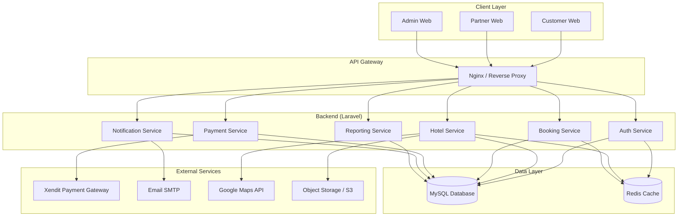
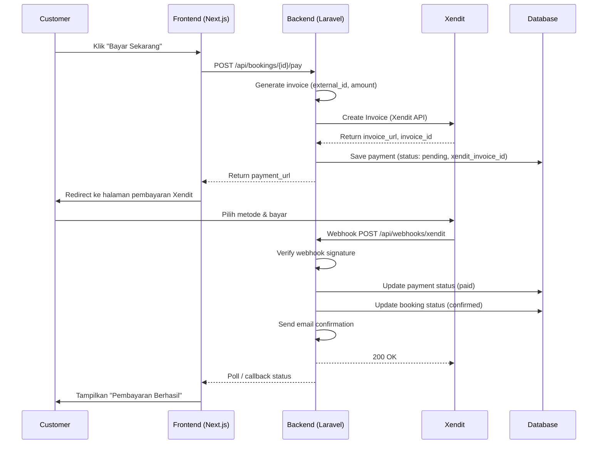
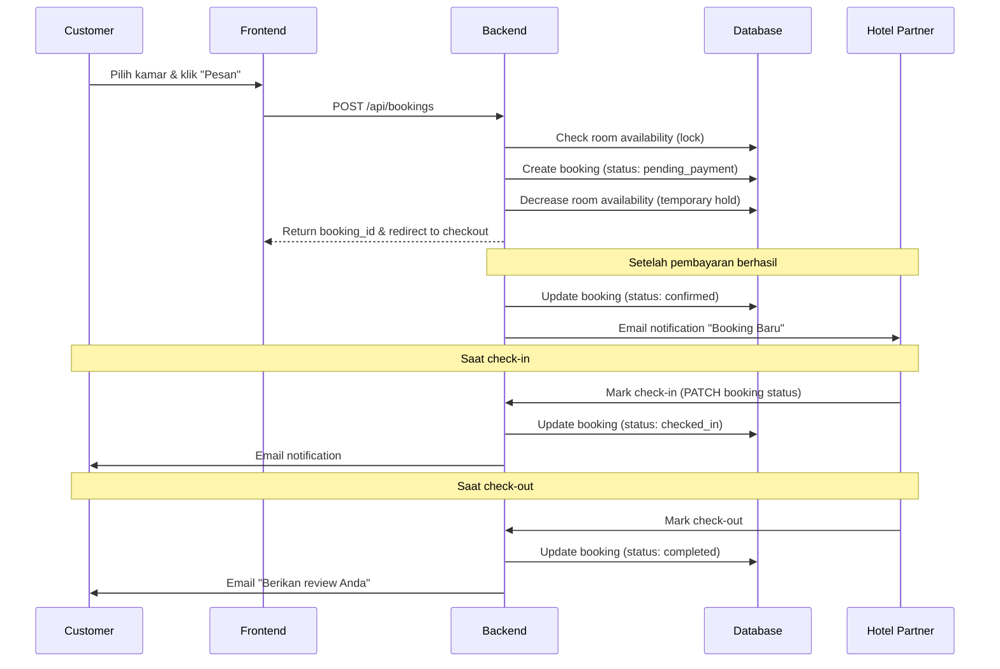
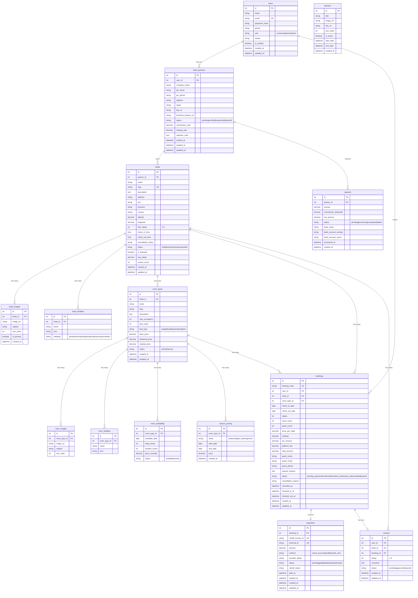

# PRD — HotelKu: Online Hotel Booking Platform

## 1. Overview

HotelKu adalah platform OTA (Online Travel Agency) yang fokus pada pemesanan hotel secara online, mirip Tiket.com namun hanya untuk segmen hotel. Platform ini menghubungkan **Hotel Partner** (vendor/pemilik hotel) dengan **Customer** (wisatawan/pemesan) dalam satu ekosistem marketplace.

### Masalah yang Diselesaikan
- Hotel kecil/sedang kesulitan menjangkau customer online tanpa bergantung pada OTA besar yang komisi tinggi.
- Customer kesulitan menemukan hotel dengan harga kompetitif dan review terpercaya di satu platform lokal.
- Proses booking manual (telepon/WhatsApp) tidak efisien dan rawan error.

### Tujuan Utama
- Menyediakan marketplace hotel B2C yang mudah digunakan oleh customer untuk mencari, membandingkan, dan memesan hotel.
- Memberikan dashboard mandiri bagi Hotel Partner untuk mengelola properti, kamar, harga, dan booking tanpa perantara.
- Menerapkan model bisnis **hybrid** (komisi per booking + markup harga) untuk revenue platform.

### Model Bisnis
| Model | Deskripsi |
|-------|-----------|
| **Komisi** | Platform mengambil persentase (misal 10-15%) dari setiap transaksi booking berhasil. |
| **Markup** | Hotel Partner menetapkan harga dasar, platform menaikkan harga untuk customer (selisih = revenue platform). |
| **Hybrid** | Kombinasi keduanya — komisi kecil + markup kecil, sehingga harga tetap kompetitif dan platform tetap untung. |

---

## 2. Requirements

### Functional Requirements

| ID | Requirement | Priority |
|----|-------------|----------|
| FR-01 | Customer dapat mencari hotel berdasarkan lokasi, tanggal check-in/out, dan jumlah tamu. | High |
| FR-02 | Customer dapat melihat detail hotel (foto, deskripsi, fasilitas, review, peta). | High |
| FR-03 | Customer dapat memilih tipe kamar dan melakukan booking. | High |
| FR-04 | Customer dapat membayar via Xendit (virtual account, e-wallet, kartu kredit). | High |
| FR-05 | Customer menerima notifikasi email setelah booking berhasil. | High |
| FR-06 | Customer dapat melihat riwayat booking dan statusnya. | High |
| FR-07 | Customer dapat memberikan review dan rating setelah checkout. | Medium |
| FR-08 | Customer dapat membatalkan booking sesuai kebijakan pembatalan. | Medium |
| FR-09 | Hotel Partner dapat mendaftar dan menunggu verifikasi admin. | High |
| FR-10 | Hotel Partner dapat mengelola properti (tambah/edit/hapus hotel). | High |
| FR-11 | Hotel Partner dapat mengelola tipe kamar dan stok ketersediaan. | High |
| FR-12 | Hotel Partner dapat mengatur harga harian dan harga khusus (weekend/high season). | High |
| FR-13 | Hotel Partner dapat melihat dan mengelola booking masuk (konfirmasi/tolak). | High |
| FR-14 | Hotel Partner dapat melihat laporan pendapatan dan statistik. | Medium |
| FR-15 | Admin dapat memverifikasi dan mengelola Hotel Partner. | High |
| FR-16 | Admin dapat mengelola semua hotel, booking, dan transaksi. | High |
| FR-17 | Admin dapat mengatur komisi dan markup global/per-hotel. | High |
| FR-18 | Admin dapat melihat laporan platform (revenue, transaksi, growth). | Medium |
| FR-19 | Admin dapat mengelola konten (banner, promo, FAQ). | Low |
| FR-20 | Sistem mengirim notifikasi email untuk event penting (booking, pembayaran, pembatalan). | High |

### Non-Functional Requirements

| ID | Requirement | Target |
|----|-------------|--------|
| NFR-01 | Response time halaman utama | < 2 detik |
| NFR-02 | Response time pencarian hotel | < 3 detik |
| NFR-03 | Uptime sistem | 99.5% |
| NFR-04 | Data terenkripsi (HTTPS, password hash) | Wajib |
| NFR-05 | Dapat menangani 1000 concurrent user | MVP |
| NFR-06 | Mobile responsive | Wajib |

---

## 3. Core Features

### 3.1 Customer Side (B2C)

#### 3.1.1 Pencarian Hotel
- Search bar: lokasi/kota/area, tanggal check-in & check-out, jumlah tamu & kamar.
- Filter: harga range, bintang (1-5), fasilitas (wifi, pool, parking, dll), tipe akomodasi (hotel, villa, resort, guesthouse).
- Sort: harga terendah, rating tertinggi, popularitas, jarak.
- Hasil pencarian menampilkan: thumbnail foto, nama hotel, bintang, harga per malam (mulai dari), lokasi singkat, rating.

#### 3.1.2 Halaman Detail Hotel
- Galeri foto (lightbox/slider).
- Informasi: nama, alamat, deskripsi, bintang, check-in/check-out time.
- Peta lokasi (embed Google Maps).
- Daftar kamar tersedia: tipe kamar, harga per malam, fasilitas kamar, kebijakan pembatalan, sisa kamar.
- Fasilitas hotel: dikategorikan (umum, kamar, makan, transport, dll).
- Review & rating dari customer yang sudah menginap.
- Rekomendasi hotel serupa di area yang sama.

#### 3.1.3 Booking & Checkout
- Pilih kamar → masuk ke halaman checkout.
- Input data tamu: nama, email, no. HP, permintaan khusus (special request).
- Ringkasan pesanan: hotel, kamar, tanggal, harga per malam × malam, pajak/fee, total.
- Pilih metode pembayaran (via Xendit).
- Konfirmasi dan bayar.

#### 3.1.4 Pembayaran (Xendit)
- Virtual Account (BCA, BNI, BRI, Mandiri, Permata).
- E-wallet (OVO, DANA, GoPay, ShopeePay).
- Kartu Kredit/Debit (Visa, Mastercard).
- Status pembayaran: pending → paid → booking confirmed.
- Webhook Xendit untuk auto-update status.

#### 3.1.5 Riwayat Booking & E-Ticket
- Daftar booking: status (upcoming, completed, cancelled).
- Detail booking: info hotel, kamar, tanggal, data tamu, status pembayaran.
- E-ticket/invoice yang bisa di-download (PDF).

#### 3.1.6 Review & Rating
- Hanya bisa review setelah tanggal check-out.
- Rating 1-5 bintang + komentar teks.
- Review ditampilkan di halaman detail hotel.

#### 3.1.7 Pembatalan Booking
- Customer dapat membatalkan booking sebelum tanggal check-in.
- Kebijakan pembatalan per hotel (refundable/non-refundable/partial refund).
- Refund diproses sesuai kebijakan (manual oleh admin atau auto).

### 3.2 Hotel Partner Side (B2B)

#### 3.2.1 Pendaftaran & Verifikasi
- Form registrasi: nama perusahaan, nama PIC, email, no. HP, alamat hotel.
- Upload dokumen: KTP, NPWP, surat izin usaha (opsional).
- Status: pending → verified/rejected (oleh admin).
- Notifikasi email saat status berubah.

#### 3.2.2 Manajemen Properti
- CRUD hotel: nama, deskripsi, alamat, kota, koordinat (lat/lng), foto (multiple upload), fasilitas, bintang, check-in/check-out time, kebijakan pembatalan default.
- Setiap hotel bisa punya multiple tipe kamar.

#### 3.2.3 Manajemen Kamar
- CRUD tipe kamar: nama kamar (Standard, Deluxe, Suite, dll), deskripsi, fasilitas kamar, kapasitas (maks tamu), foto.
- Atur harga: harga dasar per malam, harga weekend, harga high season (custom date range).
- Atur ketersediaan: kalender harian (available/unavailable/blocked), jumlah kamar per tipe.

#### 3.2.4 Manajemen Booking
- Daftar booking masuk: data customer, tanggal, kamar, status pembayaran.
- Aksi: konfirmasi booking, tolak booking (dengan alasan), tandai sudah check-in/check-out.
- Notifikasi booking baru (email + dashboard).

#### 3.2.5 Dashboard & Laporan
- Ringkasan: total booking bulan ini, pendapatan (setelah potong komisi), occupancy rate.
- Grafik booking & revenue per bulan.
- Daftar payout (pencairan dana) dan statusnya.

### 3.3 Admin Side

#### 3.3.1 Manajemen Hotel Partner
- Daftar semua partner: status (pending, verified, suspended, rejected).
- Verifikasi partner: review dokumen, approve/reject dengan catatan.
- Suspend/activate partner.

#### 3.3.2 Manajemen Hotel & Kamar
- View semua hotel di platform.
- Edit/hapus hotel jika melanggar kebijakan.
- Set hotel sebagai featured/terpopuler.

#### 3.3.3 Manajemen Booking & Transaksi
- View semua booking di platform.
- Handle dispute/refund.
- Monitor status pembayaran.

#### 3.3.4 Pengaturan Komisi & Markup
- Set komisi global (default) atau per-hotel.
- Set markup global atau per-hotel.
- Preview harga: harga dasar partner → harga yang dilihat customer.

#### 3.3.5 Laporan Platform
- Total revenue (komisi + markup).
- Jumlah transaksi harian/mingguan/bulanan.
- Top hotel (by booking count, by revenue).
- Growth metrics (new user, new partner, GMV).

#### 3.3.6 Manajemen Konten
- Banner promo di homepage.
- FAQ / bantuan.
- Pengaturan pajak/fee platform.

---

## 4. User Flow

### 4.1 Customer Flow

```
Browse Homepage
    │
    ▼
Search Hotel (lokasi, tanggal, tamu)
    │
    ▼
View Results (filter & sort)
    │
    ▼
View Hotel Detail (foto, kamar, review)
    │
    ▼
Select Room & Click "Pesan"
    │
    ▼
Checkout (input tamu data, review ringkasan)
    │
    ▼
Payment via Xendit
    │
    ├─ Success ──▶ Booking Confirmed ──▶ Email Notifikasi ──▶ E-Ticket
    │
    └─ Failed  ──▶ Retry Payment (24 jam) ──▶ Expired
    │
    ▼
Check-in Date ──▶ Stay
    │
    ▼
Check-out Date ──▶ Write Review
```

### 4.2 Hotel Partner Flow

```
Register Account
    │
    ▼
Submit Verification (upload dokumen)
    │
    ▼
Admin Review ──▶ Approved / Rejected
    │
    ▼
Login to Partner Dashboard
    │
    ▼
Add Hotel (detail, foto, fasilitas)
    │
    ▼
Add Room Types (tipe, harga, ketersediaan)
    │
    ▼
Hotel Live on Platform
    │
    ▼
Receive Booking Notification
    │
    ▼
Manage Booking (confirm/check-in/check-out)
    │
    ▼
View Reports & Payout
```

### 4.3 Admin Flow

```
Login to Admin Dashboard
    │
    ▼
Review Partner Applications
    │
    ▼
Manage Hotels & Rooms (monitor, flag, delete)
    │
    ▼
Monitor Bookings & Transactions
    │
    ▼
Handle Disputes & Refunds
    │
    ▼
Set Commission & Markup Rules
    │
    ▼
View Analytics & Reports
    │
    ▼
Manage Content (banners, promos)
```

---

## 5. Architecture

### 5.1 High-Level Architecture



### 5.2 Payment Flow (Xendit)



### 5.3 Booking Flow



---

## 6. Database Schema

### 6.1 Entity Relationship Diagram



### 6.2 Tabel Descriptions

| Tabel | Deskripsi |
|-------|-----------|
| **users** | Semua user (customer, partner, admin) dalam satu tabel dengan kolom `role`. |
| **hotel_partners** | Data extended untuk user dengan role partner. Menyimpan info perusahaan, dokumen verifikasi, dan rate komisi/markup. |
| **hotels** | Master data hotel milik partner. Menyimpan detail properti, lokasi, rating rata-rata. |
| **hotel_images** | Galeri foto hotel (multiple). |
| **hotel_facilities** | Fasilitas hotel (wifi, pool, parking, dll) dengan kategori. |
| **room_types** | Tipe kamar per hotel (Standard, Deluxe, dll) dengan harga dasar. |
| **room_images** | Foto per tipe kamar. |
| **room_facilities** | Fasilitas per tipe kamar (AC, TV, minibar, dll). |
| **room_availability** | Ketersediaan kamar per tanggal. Digunakan untuk cek real-time saat booking. |
| **season_pricing** | Harga khusus berdasarkan tanggal (weekend, high season, promo). Override harga dasar. |
| **bookings** | Data booking customer. Menyimpan snapshot harga saat booking (agar harga tetap konsisten). |
| **payments** | Data pembayaran via Xendit. 1:1 dengan booking. |
| **reviews** | Review & rating dari customer setelah menginap. |
| **payouts** | Data pencairan dana ke Hotel Partner (setelah dipotong komisi). |
| **banners** | Konten banner untuk homepage (promo, campaign). |

---

## 7. API Endpoints (Backend Laravel)

### 7.1 Authentication

| Method | Endpoint | Description |
|--------|----------|-------------|
| POST | /api/auth/register | Register (customer) |
| POST | /api/auth/login | Login, return JWT token |
| POST | /api/auth/logout | Logout, invalidate token |
| POST | /api/auth/forgot-password | Send reset password email |
| POST | /api/auth/reset-password | Reset password with token |
| GET | /api/auth/me | Get current user profile |
| PUT | /api/auth/me | Update current user profile |

### 7.2 Hotels (Public)

| Method | Endpoint | Description |
|--------|----------|-------------|
| GET | /api/hotels | Search & list hotels (query, filter, sort, pagination) |
| GET | /api/hotels/{slug} | Get hotel detail |
| GET | /api/hotels/{slug}/rooms | Get available rooms (with date params) |
| GET | /api/hotels/{slug}/reviews | Get hotel reviews |

### 7.3 Bookings (Customer)

| Method | Endpoint | Description |
|--------|----------|-------------|
| POST | /api/bookings | Create new booking |
| GET | /api/bookings | List my bookings |
| GET | /api/bookings/{code} | Get booking detail |
| POST | /api/bookings/{code}/cancel | Cancel booking |
| POST | /api/bookings/{code}/pay | Initiate payment |
| GET | /api/bookings/{code}/invoice | Download invoice PDF |

### 7.4 Reviews (Customer)

| Method | Endpoint | Description |
|--------|----------|-------------|
| POST | /api/reviews | Create review (only after checkout) |
| GET | /api/reviews/my | List my reviews |

### 7.5 Partner Dashboard

| Method | Endpoint | Description |
|--------|----------|-------------|
| POST | /api/partner/register | Register as hotel partner |
| POST | /api/partner/verify | Submit verification documents |
| GET | /api/partner/profile | Get partner profile & status |
| GET | /api/partner/hotels | List my hotels |
| POST | /api/partner/hotels | Create new hotel |
| PUT | /api/partner/hotels/{id} | Update hotel |
| DELETE | /api/partner/hotels/{id} | Delete hotel |
| GET | /api/partner/hotels/{id}/rooms | List rooms for hotel |
| POST | /api/partner/hotels/{id}/rooms | Create room type |
| PUT | /api/partner/rooms/{id} | Update room type |
| DELETE | /api/partner/rooms/{id} | Delete room type |
| PUT | /api/partner/rooms/{id}/availability | Update room availability |
| GET | /api/partner/bookings | List bookings for my hotels |
| PUT | /api/partner/bookings/{id}/status | Update booking status (confirm/reject/check-in/check-out) |
| GET | /api/partner/reports | Get revenue & booking reports |
| GET | /api/partner/payouts | List payouts |

### 7.6 Admin

| Method | Endpoint | Description |
|--------|----------|-------------|
| GET | /api/admin/partners | List all partners |
| GET | /api/admin/partners/{id} | Get partner detail |
| PUT | /api/admin/partners/{id}/status | Approve/reject/suspend partner |
| GET | /api/admin/hotels | List all hotels |
| PUT | /api/admin/hotels/{id}/status | Update hotel status |
| PUT | /api/admin/hotels/{id}/featured | Set/unset featured |
| GET | /api/admin/bookings | List all bookings |
| PUT | /api/admin/bookings/{id}/refund | Process refund |
| GET | /api/admin/commissions | List commission settings |
| PUT | /api/admin/commissions/{partner_id} | Set commission for partner |
| GET | /api/admin/reports | Platform analytics |
| GET | /api/admin/banners | List banners |
| POST | /api/admin/banners | Create banner |
| PUT | /api/admin/banners/{id} | Update banner |
| DELETE | /api/admin/banners/{id} | Delete banner |

### 7.7 Webhooks

| Method | Endpoint | Description |
|--------|----------|-------------|
| POST | /api/webhooks/xendit | Xendit payment callback |

---

## 8. Technology Stack

| Layer | Technology | Notes |
|-------|-----------|-------|
| **Frontend** | Next.js 14+ (App Router) | SSR/SSG untuk SEO, React Server Components |
| **Styling** | Tailwind CSS + shadcn/ui | Component library, rapid development |
| **State Management** | Zustand / TanStack Query | Server state via TanStack Query, client state via Zustand |
| **Backend** | Laravel 11 (PHP 8.3+) | REST API, Eloquent ORM |
| **Database** | MySQL 8.0 | Primary data store |
| **Cache** | Redis | Session, query cache, rate limiting |
| **Payment** | Xendit | Invoice API, webhooks |
| **Email** | Laravel Mail + SMTP (Mailgun/SendGrid) | Transactional emails |
| **Storage** | Local (dev) / S3-compatible (prod) | Hotel & room images |
| **Maps** | Google Maps Embed API | Hotel location display |
| **Auth** | Laravel Sanctum (SPA) | Token-based auth for API |
| **Queue** | Laravel Queue + Redis | Async jobs (email, notifications, reports) |
| **Container** | Docker + Laravel Sail | Development environment |

---

## 9. Design & Technical Constraints

### 9.1 Architecture Principles
- **Monolith First:** Backend Laravel monolith, tidak perlu microservice untuk MVP.
- **API-First:** Backend murni REST API, frontend Next.js consume via HTTP.
- **SPA Hydration:** Next.js menggunakan ISR (Incremental Static Regeneration) untuk halaman hotel (SEO), client-side untuk dashboard interaktif.
- **Mobile Responsive:** Semua halaman harus responsif, desktop-first untuk dashboard partner/admin.

### 9.2 Security
- Password hash menggunakan bcrypt.
- JWT token via Laravel Sanctum dengan expiry.
- Rate limiting pada API endpoint (terutama auth & payment).
- Input validation & sanitization di semua endpoint.
- Xendit webhook signature verification.
- CORS dikonfigurasi untuk domain frontend saja.
- SQL injection prevention via Eloquent ORM (parameterized queries).

### 9.3 Typography Rules
- **Sans:** `Geist Mono, ui-monospace, monospace`
- **Serif:** `serif`
- **Mono:** `JetBrains Mono, monospace`

### 9.4 File Upload Constraints
- Maks 5MB per image.
- Format: JPEG, PNG, WebP.
- Auto-resize: max 1920px width, compress quality 80%.
- Storage: S3-compatible (MinIO dev, AWS S3 prod).

### 9.5 Payment Constraints (Xendit)
- Invoice expired dalam 24 jam.
- Booking tanpa pembayaran dalam 24 jam auto-expired → room availability dikembalikan.
- Refund: manual process oleh admin (Xendit tidak support auto-refund untuk semua metode).
- Minimum transaksi: Rp 10.000.
- Maksimum transaksi: sesuai limit Xendit per metode.

### 9.6 SEO Considerations
- Halaman hotel detail menggunakan SSR/ISR (Next.js).
- URL slug-based: `/hotels/hotel-nusa-indah-jakarta`.
- Meta tags dinamis (title, description, OG image) per hotel.
- Structured data (JSON-LD) untuk hotel schema.org.
- Sitemap.xml auto-generated.

### 9.7 Performance
- Database indexing pada kolom yang sering di-query (city, check_in_date, hotel_id, status).
- Redis cache untuk pencarian populer & data hotel yang jarang berubah.
- Image optimization (WebP, lazy loading, CDN).
- Pagination pada semua list endpoint (default 20 per page).

---

## 10. MVP Scope & Milestones

### Phase 1 — Foundation (Minggu 1-2)
- [ ] Setup project: Laravel API + Next.js frontend
- [ ] Auth system (register, login, JWT)
- [ ] Database schema & migrations
- [ ] Admin can create hotel & room types (manual, no partner yet)

### Phase 2 — Core Booking (Minggu 3-4)
- [ ] Hotel search & filter (public API)
- [ ] Hotel detail page with rooms
- [ ] Booking flow (create booking, check availability)
- [ ] Xendit payment integration
- [ ] Email notifications (booking confirmed, payment received)

### Phase 3 — Partner System (Minggu 5-6)
- [ ] Partner registration & verification
- [ ] Partner dashboard: CRUD hotel, rooms, availability, pricing
- [ ] Partner booking management (confirm, check-in, check-out)
- [ ] Commission & markup calculation

### Phase 4 — Reviews & Polish (Minggu 7-8)
- [ ] Review & rating system
- [ ] Customer booking history & e-ticket
- [ ] Cancellation & refund flow
- [ ] Partner reports & payout
- [ ] Admin analytics dashboard
- [ ] Banner/content management
- [ ] SEO optimization
- [ ] Testing & bug fixes

---

## 11. Open Questions & Risks

| # | Question / Risk | Impact | Mitigation |
|---|-----------------|--------|------------|
| 1 | Xendit trial account limits (transaction volume) | Mungkin ada limit transaksi harian/bulanan | Verifikasi limit dengan Xendit sebelum launch, siapkan upgrade plan |
| 2 | Concurrent booking (2 user booking kamar terakhir bersamaan) | Double booking, oversell | Gunakan database locking (pessimistic/optimistic) saat check availability |
| 3 | Refund policy inconsistency antar hotel | Customer confusion | Buat template kebijakan pembatalan yang bisa dipilih partner (Strict, Moderate, Flexible) |
| 4 | Hotel partner tidak update ketersediaan (manual process) | Booking untuk kamar yang sebenarnya tidak tersedia | Wajibkan partner konfirmasi booking dalam 1 jam, auto-reject jika tidak |
| 5 | Scalability MySQL untuk search hotel | Lambat jika data hotel besar | Implementasi Elasticsearch/Meilisearch untuk full-text search di fase selanjutnya |
| 6 | Legalitas & izin usaha OTA | Potensi masalah regulasi | Konsultasi legal sebelum launch, pastikan Terms of Service & Privacy Policy lengkap |
